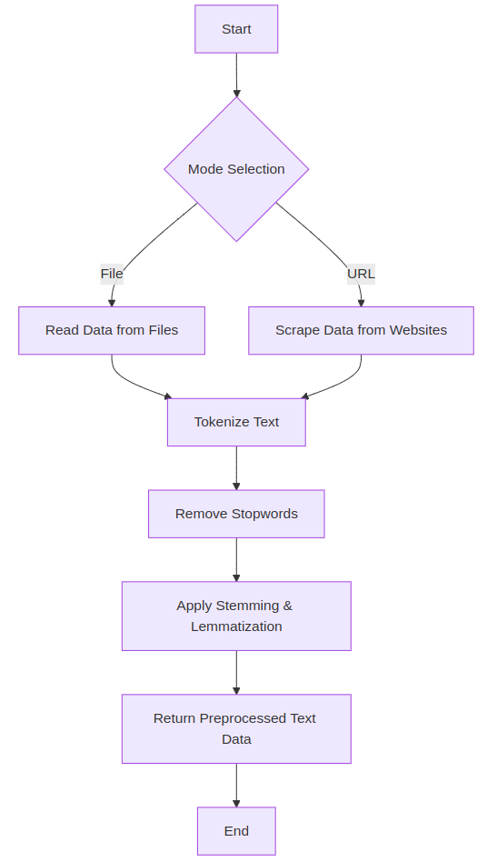
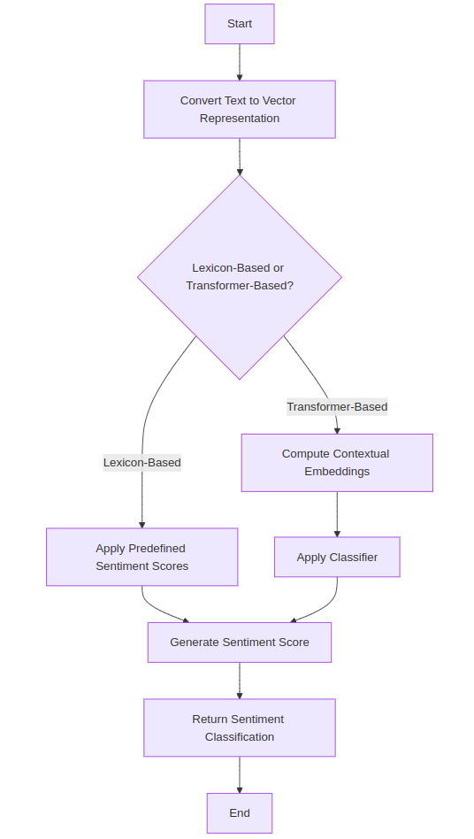
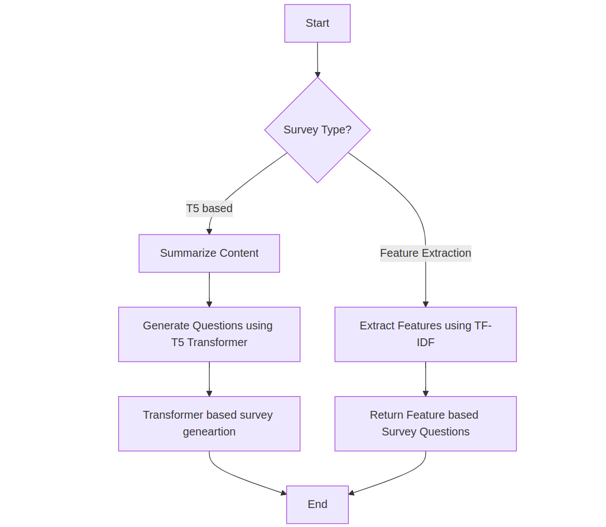
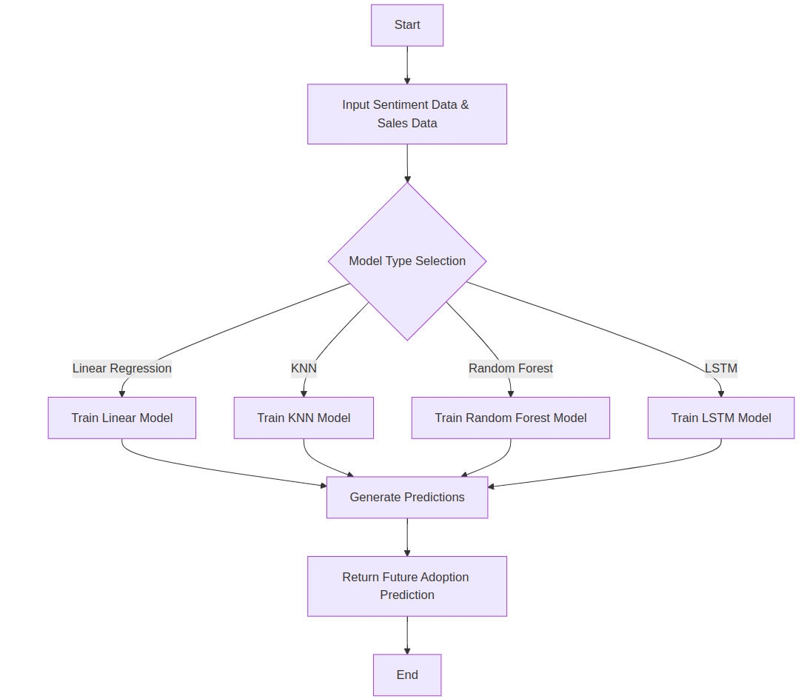
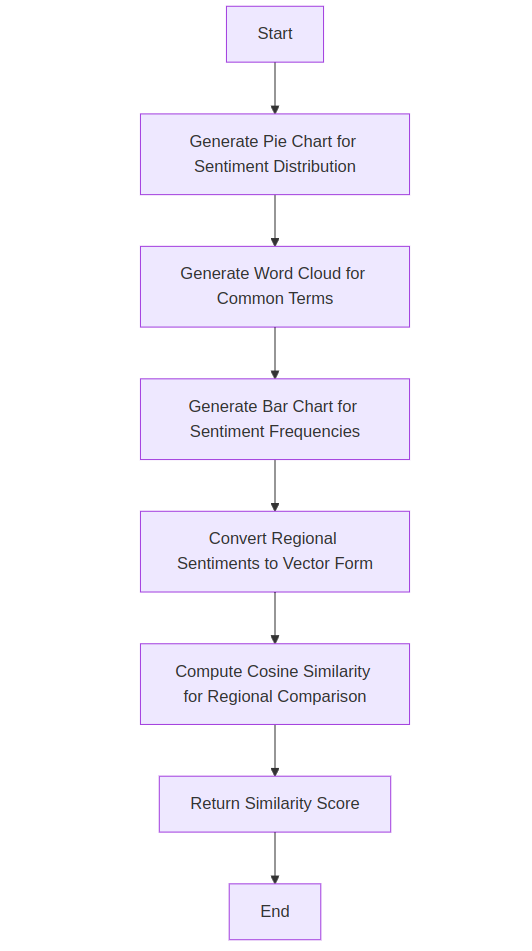
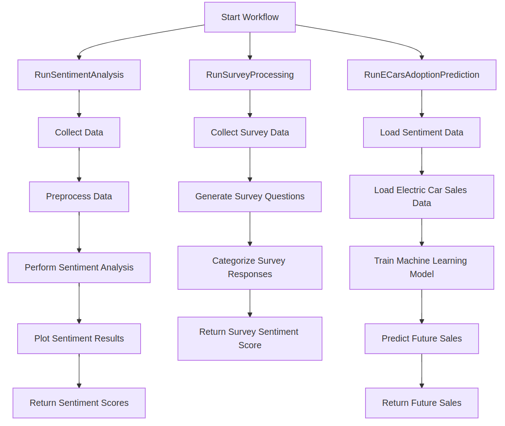

#### Data Collection
----------

```
flowchart TD
    A[Start] --> B{Mode Selection}
    B -->|File| C[Read Data from Files]
    B -->|URL| D[Scrape Data from Websites]
    C --> F[Tokenize Text]
    D --> F
    F --> G[Remove Stopwords]
    G --> H[Apply Stemming & Lemmatization]
    H --> I[Return Preprocessed Text Data]
    I --> J[End]
```
 

#### Sentiment Analysis
----------


```
flowchart TD
    A[Start] --> B[Convert Text to Vector Representation]
    B --> C{Lexicon-Based or Transformer-Based?}
    C -->|Lexicon-Based| D[Apply Predefined Sentiment Scores]
    C -->|Transformer-Based| E[Compute Contextual Embeddings]
    D --> F[Generate Sentiment Score]
    E --> G[Apply Classifier]
    G --> F
    F --> H[Return Sentiment Classification]
    H --> I[End]

```
 

#### Survey Question Generation 

```
flowchart TD
    A[Start] --> B{Survey Type?}
    B -->|T5 based| C[Summarize Content]
    C --> E[Generate Questions using T5 Transformer]
    E --> I[ Transformer based survey geneartion]
    I --> H
    
    B -->|Feature Extraction| F[Extract Features using TF-IDF]
    F --> G[Return Feature based Survey Questions]
    G --> H[End]

```
     

#### Electric Car Adoption Prediction

```
flowchart TD
    A[Start] --> B[Input Sentiment Data & Sales Data]
    B --> C{Model Type Selection}
    C -->|Linear Regression| D[Train Linear Model]
    C -->|KNN| E[Train KNN Model]
    C -->|Random Forest| F[Train Random Forest Model]
    C -->|LSTM| G[Train LSTM Model]
    D --> H[Generate Predictions]
    E --> H
    F --> H
    G --> H
    H --> I[Return Future Adoption Prediction]
    I --> J[End]

```
 

#### Sentiment Visualization

```
flowchart TD
    A[Start] --> B[Generate Pie Chart for Sentiment Distribution]
    B --> C[Generate Word Cloud for Common Terms]
    C --> D[Generate Bar Chart for Sentiment Frequencies]
    D --> E[Convert Regional Sentiments to Vector Form]
    E --> F[Compute Cosine Similarity for Regional Comparison]
    F --> G[Return Similarity Score]
    G --> H[End]

```
 

#### Execution Flow

```
graph TD
    %% Main Entry Point
    A[Start Workflow] --> B[RunSentimentAnalysis]
    A --> C[RunSurveyProcessing]
    A --> D[RunECarsAdoptionPrediction]

    %% Sentiment Analysis Workflow
    B --> E[Collect Data]
    E --> F[Preprocess Data]
    F --> G[Perform Sentiment Analysis]
    G --> H[Plot Sentiment Results]
    H --> I[Return Sentiment Scores]

    %% Survey Processing Workflow
    C --> J[Collect Survey Data]
    J --> K[Generate Survey Questions]
    K --> L[Categorize Survey Responses]
    L --> M[Return Survey Sentiment Score]

    %% Electric Car Adoption Prediction Workflow
    D --> N[Load Sentiment Data]
    N --> O[Load Electric Car Sales Data]
    O --> P[Train Machine Learning Model]
    P --> Q[Predict Future Sales]
    Q --> R[Return Future Sales]
```

 
