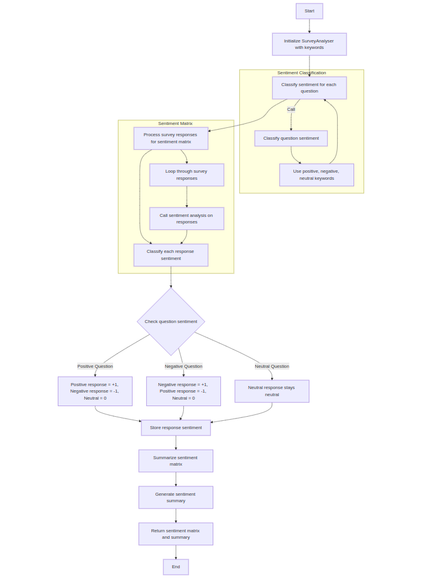
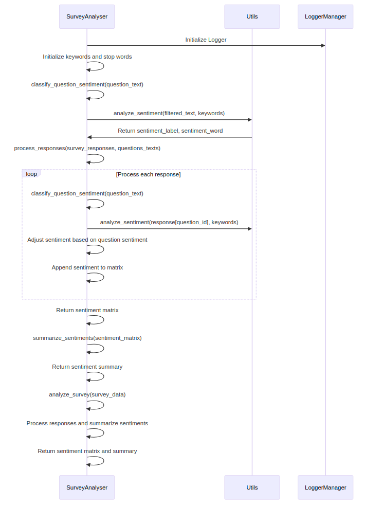

# SurveyAnalyser Class

The `SurveyAnalyser` class processes survey responses and classifies them based on sentiment using predefined sentiment keywords (positive, negative, neutral). It applies sentiment classification to both questions and responses, providing a sentiment matrix and a summary of sentiment distribution for a given survey.

## Features:
- **Classify the sentiment of survey questions:** Classifies the sentiment of each question based on predefined positive, negative, and neutral keywords.
- **Classify the sentiment of survey responses:** Processes individual responses and classifies their sentiment.
- **Process responses and create a sentiment matrix:** Analyzes the sentiment of responses and creates a matrix that maps questions to response sentiment.
- **Summarize sentiment counts for each question:** Generates a summary of the sentiment distribution (positive, neutral, negative) for each survey question.

---

## Setup and Requirements

### Dependencies:
- `pandas`
- `nltk`
- `transformers`
- `utils.log_utils`
- `utils.utils`

### Installation:
1. Clone the repository:
   ```bash
   git clone https://github.com/your-repository/survey-analyzer.git

## Workflow

The workflow consists of several key steps, which are visualized in the flowchart below:

 
  <!-- Replace with actual path to your image -->
