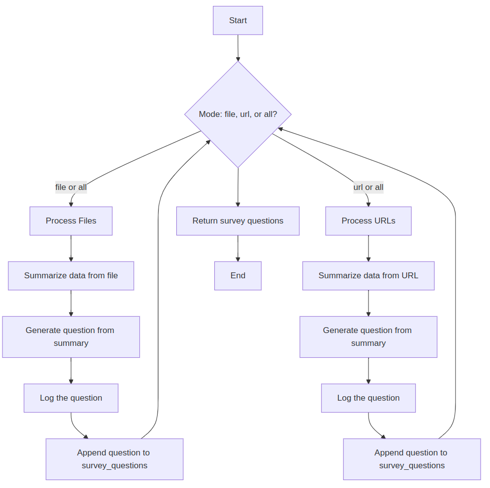
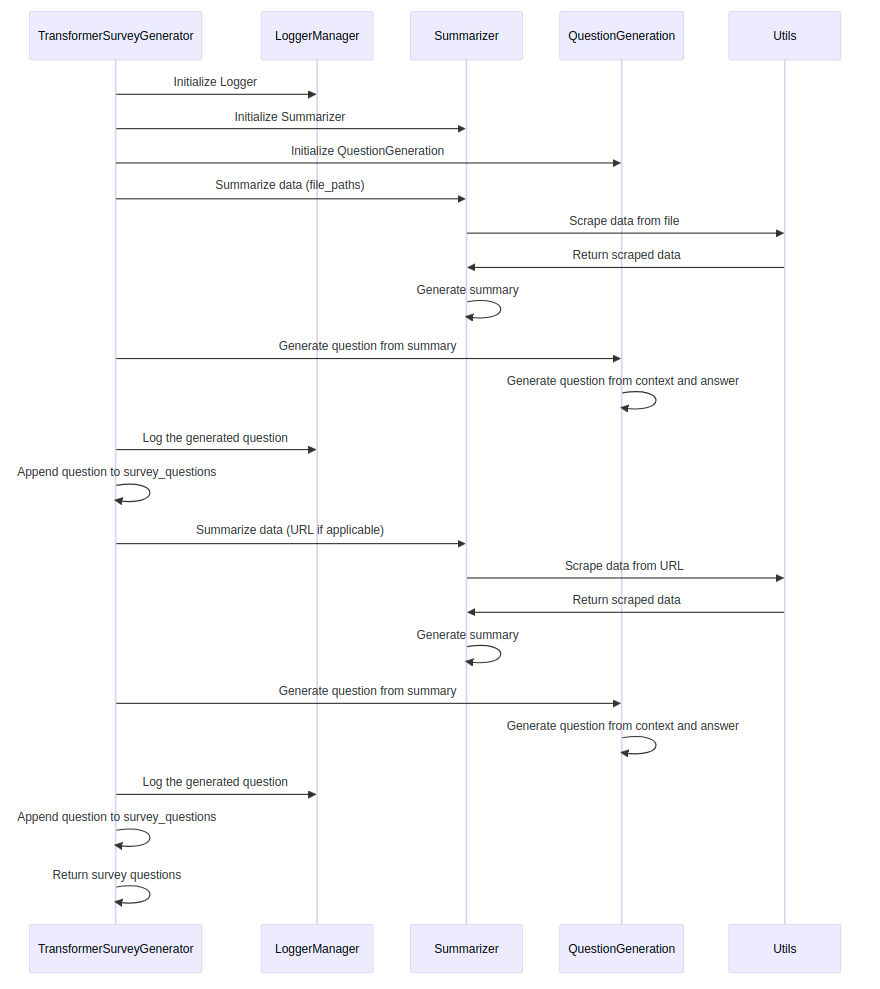

# Transformer Survey Generator

This project involves generating survey questions based on summarized data. The `TransformerSurveyGenerator` class processes input data (from files or URLs), summarizes it using the `Summarizer` class, and then generates questions using the `QuestionGeneration` class. These questions are then returned in a survey format with Likert scale options.

## Overview

This script generates survey questions by processing contextual data and creating multiple-choice questions based on a given context. It leverages a fine-tuned T5 model for question generation. The process involves:

1. **Summarizing** data from either files or URLs.
2. **Generating questions** from the summarized content.
3. **Logging** the output and appending the generated questions to the list.
4. Returning the list of survey questions with response options.

### Key Components:
- **TransformerSurveyGenerator**: The main class that orchestrates the workflow of summarizing data and generating survey questions.
- **Summarizer**: A class that uses a summarization model to summarize long texts into concise summaries.
- **QuestionGeneration**: A class that generates questions based on the summarized context using a pre-trained T5 model.

## Workflow

The workflow consists of several key steps, which are visualized in the flowchart below:

 
  <!-- Replace with actual path to your image -->
